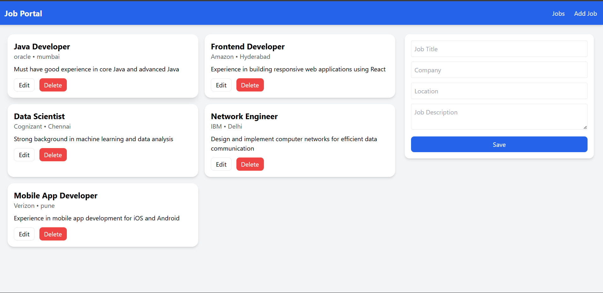

# 📌 Job Portal Application

A **full-stack Job Portal App** built with:  
- **Backend** → Spring Boot + MySQL + Spring Data JPA (REST APIs)  
- **Frontend** → React + Vite + TailwindCSS  

This project demonstrates **end-to-end CRUD operations** (Create, Read, Update, Delete) for job postings with a persistent database, modern UI, and clean architecture.  

---

## ⚙️ Features

### 🔹 Backend (Spring Boot + MySQL + JPA)

- **Entity Model**: Represents job postings with fields →  
  `id, title, company, location, description`  
  - `id` is **auto-generated** using MySQL `AUTO_INCREMENT`
- **REST Endpoints** (in `JobController`):
  - `GET /jobs` → Fetch all jobs  
  - `GET /job/{id}` → Fetch a specific job by ID  
  - `POST /job` → Add a new job  
  - `PUT /job` → Update an existing job  
  - `DELETE /job/{id}` → Delete a job  
- **Repository Layer (`JobRepo`)**  
  - Extends `JpaRepository<JobPost, Integer>`  
  - Provides built-in database operations  
- **Service Layer (`JobService`)**  
  - Acts as a middle layer between controller and repo  
  - Keeps code modular & business-logic clean  
- **Database**:  
  - MySQL used for persistence  
  - Schema auto-managed by JPA (`spring.jpa.hibernate.ddl-auto=update`)  

---

### 🔹 Frontend (React + Vite + Tailwind)

- Fetches jobs from backend (`http://localhost:8080`)  
- Displays **job cards** (title, company, location, description)  
- Provides a form to **add / edit jobs**  
- Allows **deleting jobs** with confirmation  
- **Responsive modern UI** using TailwindCSS  
- **Minimal Navbar** for easy navigation  

---

## 🗂️ Project Structure

```
job-portal-app/
├── backend/                              # Spring Boot application
│   ├── src/main/java/com/mahesh/job_portal_app/
│   │   ├── model/JobPost.java
│   │   ├── controller/JobController.java
│   │   ├── service/JobService.java
│   │   └── repo/JobRepo.java
│   └── pom.xml
│
├── frontend/                             # React frontend application
│   ├── src/
│   ├── package.json
│   └── vite.config.js
│
└── start-job-portal.bat                  # One-click starter script
```

---

## 🚀 Getting Started

### 1️⃣ Clone Repository
```bash
git clone https://github.com/<your-username>/job-portal-app.git
cd job-portal-app
```

---

### 2️⃣ Configure Database (MySQL)
Create a new database in MySQL:
```sql
CREATE DATABASE job_portal;
```

Update `application.properties` in `backend/src/main/resources`:
```properties
spring.datasource.url=jdbc:mysql://localhost:3306/job_portal
spring.datasource.username=root
spring.datasource.password=yourpassword
spring.jpa.hibernate.ddl-auto=update
spring.jpa.show-sql=true
```

---

### 3️⃣ Start Backend (Spring Boot)
```bash
cd backend
mvn spring-boot:run
```
Backend runs at → [http://localhost:8080](http://localhost:8080)

---

### 4️⃣ Start Frontend (React)
```bash
cd frontend
npm install
npm run dev
```
Frontend runs at → [http://localhost:5173](http://localhost:5173)

---

## ⚡ Quick Start with Batch Script (Windows)
Instead of starting backend & frontend separately:
```bash
start-job-portal.bat
```

---

## 🖥️ API Endpoints

| Method | Endpoint        | Description            | Request Body                                         |
|--------|----------------|------------------------|-----------------------------------------------------|
| GET    | `/jobs`        | Get all jobs           | —                                                   |
| GET    | `/job/{id}`    | Get job by ID          | —                                                   |
| POST   | `/job`         | Add new job            | `{ title, company, location, description }`         |
| PUT    | `/job`         | Update existing job    | `{ id, title, company, location, description }`     |
| DELETE | `/job/{id}`    | Delete job by ID       | —                                                   |

---

## 📌 Example Job Object
```json
{
  "id": 1,
  "title": "Java Developer",
  "company": "Oracle",
  "location": "Mumbai",
  "description": "Must have good experience in core Java and advanced Java"
}
```

---

## 🛠️ Tech Stack

### Backend:
- Java 17  
- Spring Boot  
- Spring Data JPA  
- MySQL  

### Frontend:
- React (Vite)  
- TailwindCSS  
- Axios (API calls)  

---

## 📚 Future Enhancements

- 🔐 User authentication & role-based access (Admin / Candidate)  
- 🔍 Advanced search & filtering for jobs  
- 📄 Resume upload & application tracking  
- ☁️ Deploy backend & frontend to cloud (AWS / Azure / Render)  

---

## 📸 Screenshots


---

✨ Built with ❤️ by **Mahesh**  
